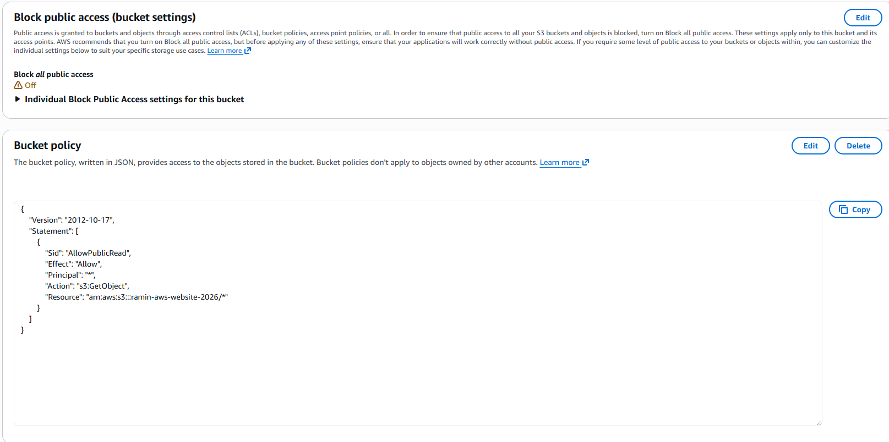

# AWS Static Website Hosting Project
##  Project Overview

This project demonstrates deploying a static website to AWS using Amazon S3 static website hosting.

## Technologies Used

- HTML / CSS / JavaScript

- Amazon S3

- AWS IAM (basic permissions)

- AWS Free Tier

## Architecture

User → S3 Static Website Hosting → Public Website Endpoint

## Steps Performed

1. Created S3 bucket

2. Disabled block public access

3. Configured bucket policy for public read

4. Enabled static website hosting

5. Uploaded website files

6. Verified deployment via endpoint URL

## Live Demo

http://ramin-aws-website-2026.s3-website-ap-southeast-2.amazonaws.com

## Screenshots

### S3 Bucket Configuration

### Static Website Hosting Enabled

### Live Website

### Architecture

## Skills Demonstrated

- Cloud storage configuration

- AWS security policies

- Static website hosting

- Troubleshooting 403 & 404 errors
